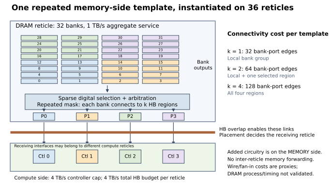
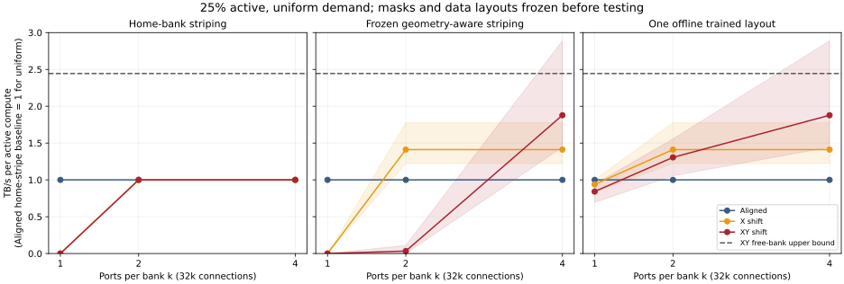
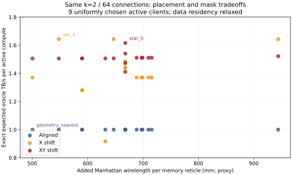
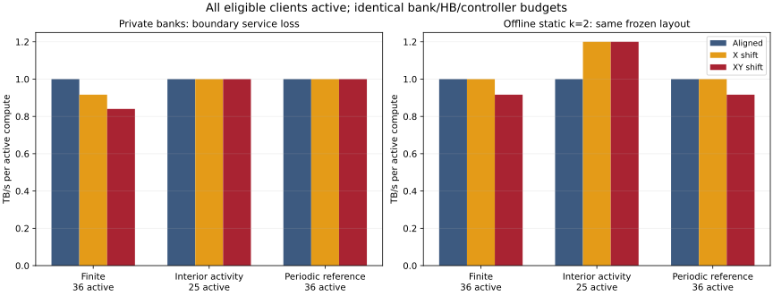

# Repeated-reticle WoW：bounded bank-to-HB sharing Gate

研究边界已收窄为：**reticle-level physical organization 如何约束实际的 memory-access graph**。实现保留三层关系：Compute → 几何 HB 接口 → bank-to-port mask → 静态数据。不是发明 HB DRAM、发现资源孤岛、提高 wafer NoC radix 或设计 LLM scheduler。


## Gate 判断：部分通过，暂不升级到真实 workload / DRAM timing

**有一个可信的非 oracle 正结果，但还没有满足强版 paper 主张。** 25% 随机活动、静态几何 striping 时，X-shift 的 k=2 为 **1.411 TB/s/active compute**，比 Aligned 高 **41.1%**，并匹配 X 自己的 k=4。离线只选一次布局时，XY 的 k=2 为 **1.306**，XY 的 k=4 为 **1.878**。所选 k=2 模板随 placement 改变：X 选水平配对 `xor_1`，XY 的离线模式选对角配对 `xor_3`。

不过，X 的公共完成带宽是 **0.933**，低于 Aligned 的 **1.000**；XY 离线 k=2 只有 **0.717**。平均吞吐收益没有自动转化为慢请求保障。X 在集中/空间相关的 25% 活动下，固定 striping 的收益分别降到 **16.7% / 8.9%**；hotspot 的增益只有约 **3.3%**，全活动 hotspot 还有约 **2.0%** 回退。

也不能把“匹配 X 的 full interface”写成“捕获全局 full-pooling 大部分增益”：相对于 Aligned=1，X k=2 的增量 0.411，只占本轮 XY 静态 k=4 增量 0.878 的 **46.8%**，占 XY free-bank 上界增量 1.444 的 **28.5%**。这些上界来自本轮 held-out seeds，不应与首轮 2.467 混用。

固定 home 的三种 placement 在恢复数据可达性后都只有 1.000，因此收益需要合适的**静态分布式数据布局**，并非不改地址组织即可获得。XY 在固定几何 striping、k=2 下的 0.033 是大面积数据不可达的兼容性失败，不代表一个带远程 fallback 的完整系统会慢到这个数；这里没有那条 fallback 路径。离线重选一次兼容布局后恢复到 1.306，表明不能只用最差不匹配布局评价 XY。

本轮足以保留“物理组织约束可用 bank exposure”这一研究问题；不足以宣称普遍、低成本、接近全共享的方案。若继续，应仍锁在这一层：用公共完成率/最低服务保障约束模板与静态布局的选择，并核实 memory-side wiring/arbitration 成本。无需因此扩展成 scheduler、NoC 或全系统 DRAM simulator。

## 本轮实现与硬件位置



共享假设位于 **memory-side digital bank-output selection/arbitration、HB 之前**。每个 memory reticle 重复完全相同的 32-bank/4-region 模板；k=1/2/4 分别有 32/64/128 条 bank-port 连接。k=4 已是四端口全连接，不能作为“稀疏”证据。我们没有把它替换成 logic-side crossbar，也没有把 RDL 当免费任意交换网络。

全部 placement 保持 36C+36M、每 memory 1 TB/s、每 compute controller 4 TB/s、每 reticle 总 HB 4 TB/s。每 bank 0.5 GiB、1/32 TB/s。每个 compute 有 4 GiB 独有数据，划为 128 个粗粒度地址块；全系统只占用 144/576 GiB，既无复制也无运行时搬移。带宽是 functional fluid bound，不是硅实现预测；当前也不区分读写周转和 DRAM 时序。

有限几何是 300 mm 圆内的匹配 6×6 矩形阵列，不是圆形 wafer 的最大利用率铺排。HB 区域代表接口候选面积，没有完成 pad-level alignment、DRAM-side routing 或电路时序验证。重复模板是本研究采用的约束，不是所有 wafer-scale 工艺的普遍禁令。

## 静态数据约束为何改变结果

每个请求流有固定的 bank 字节比例；LP 只优化服务速率和允许路径上的流量。对于 client c、bank b，必须满足 `sum(path_flow[c,b]) = byte_share[c,b] * stream_rate[c]`。缺失任何正权重数据，都会阻塞该完整流；不能丢掉不可达字节后宣称剩余流量是完成吞吐。

固定 home 布局把每个 client 的数据留在自己的 memory reticle。即使有更多邻居，没有邻居上所需数据，也不可能回收它们的闲置服务能力。本轮另外使用一次性几何 striping，并在每种 placement 内严格跨 k 冻结；它不观察任何 workload，但并不是跨 placement 完全相同的物理地址表。离线优化模式只用训练集，从四种布局启发式中选择一次，然后冻结。它是有限候选搜索，不是全局静态布局最优解。

训练 seeds=0,1，测试 seeds=100–109，测试 active 比例为 25/50/75/100%，覆盖 uniform/hotspot/clustered/correlated。所有设计复用相同请求；模板和地址布局均不因测试 phase 改变。Oracle 放松数据驻留，只作上界。Common completion 和 P5 是流体模型指标，不是实测完成延迟。

详细配置、方程解释、约束与复现命令见 [方法说明](BANK_GATE_METHOD.md)；已有工作与尚未核实的 novelty 判断见 [文献审计](BANK_RELATED_WORK.md)。

## 为什么不是简单“稀疏图像 expander 所以有效”



图中的阴影为 10 个测试 seed 的最小/最大值，不是置信区间。横轴 k 改变 bank-port 边数；HB/controller 预算保持不变。

X-shift 的两个不同 memory-side 列映射到不同 compute，但同一列的两个 HB region 可以通向同一个 compute。`xor_1` 给每个 bank 增加另一个列的端口，就暴露给了两个可能的 compute。k=4 的其余 bank-port 边在当前 bank/HB 预算下不再增加客户端可达性。实际核对 X 的全部 688 对 k=2/k=4 记录，静态布局哈希相同，吞吐量与公共完成率相同（浮点容差内）。因此这里的等价主要来自**消除重复客户端暴露**，不是一般稀疏 crossbar 理论。

XY 的四个区域通常对应四个不同 compute。相同 k=2 没法暴露给全部四者；物理邻居更多，所需接口灵活性也更高。有限候选搜索得到不同有用模板，是 coupling 的证据，但不是全局联合综合最优性的证明。Aligned 没有转发路径，所以它在本模型内无法借用其他 memory reticle；胜过它不等于胜过带公平预算 NoC 的替代架构。



k=2 为每 reticle 64 条连接，X 配对的 port fan-in 为 16/16/16/16；k=4 则有 128 条连接、fan-in 32/32/32/32。X k=2 的新增 Manhattan wirelength proxy 为 548 mm，k=4 为 2124 mm。这是所有连接中心线长度之和，不是单根线长，更不是面积/能耗或可布通证明。等 k 不等同于等 wirelength：XY 离线选中的 xor_3 为 944 mm；这里只固定连接数和 HB/controller 预算，并逐项列出其余成本。

## Expansion/min-cut 的解释边界

所有测试记录的 oracle max-flow 都等于可达 bank 并集的总服务量。这不是偶然拟合：单条 HB 边至少 1 TB/s，而整个 memory 只有 1 TB/s；每个 compute 最多连接四个 memory、controller cap=4 TB/s。将每个可达 bank 分配给任意活动邻居就能满足这些资源限制，因此邻域覆盖界在本参数下可达。Cut 边的 HB/bank/controller 分类可能有多个等价解，不能把某一分解误当唯一瓶颈定位。

对恰好 A 个随机活动 compute，bank b 被覆盖的概率是 `1-C(36-r_b,A)/C(36,A)`，r_b 为能够访问它的不同 compute 数。由此得到无采样误差的期望。在 XY 周期参考中 r_b=k，同 k 的所有候选模板期望 oracle 吞吐完全一样。不能用该场景证明 expander-inspired mask 更优；相关活动、固定数据或更紧接口预算才会区分其他结构属性。

首轮 2.467 / 1.828 / 1.889 已通过 22 个独立 max-flow/cut 复核，并可由 memory 邻域并集直接解释。固定 residency 下 min-cut 只是上界；实际服务还受固定字节比例和不可达数据限制。



首轮 private 全活动 36→30.25 TB/s 的差额，在本模型中完全由 23 个未匹配的四分之一服务区域解释：23×0.25=5.75 TB/s。周期参考恢复 36；共同内部 25 个活动 compute 各得到 1。与此同时，固定 home/private 的数据不可达在周期参考仍存在，故不能把这类损失也归因于 wafer 边缘。

## 25% 随机活动：TB/s / active compute（10 seeds 均值）

| 数据布局 | Placement | k=1 | k=2 | k=4 | k=2 公共完成带宽 |
|---|---|---:|---:|---:|---:|
| 固定 home | Aligned | 1.000 | 1.000 | 1.000 | 1.000 |
| 固定 home | X | 0.000 | 1.000 | 1.000 | 1.000 |
| 固定 home | XY | 0.000 | 1.000 | 1.000 | 1.000 |
| 固定几何 striping | Aligned | 1.000 | 1.000 | 1.000 | 1.000 |
| 固定几何 striping | X | 0.000 | 1.411 | 1.411 | 0.933 |
| 固定几何 striping | XY | 0.000 | 0.033 | 1.878 | 0.000 |
| 离线选一次 | Aligned | 1.000 | 1.000 | 1.000 | 1.000 |
| 离线选一次 | X | 0.939 | 1.411 | 1.411 | 0.933 |
| 离线选一次 | XY | 0.842 | 1.306 | 1.878 | 0.717 |
| 自由 bank 上界 | Aligned | 1.000 | 1.000 | 1.000 | 1.000 |
| 自由 bank 上界 | X | 0.939 | 1.611 | 1.611 | 1.100 |
| 自由 bank 上界 | XY | 0.842 | 1.611 | 2.444 | 1.188 |

公共完成带宽是各活动请求流采用同一完成比例时的每客户端带宽，等于本场景的 common-rate P5；不是某个任意吞吐最优解的 P5。

## 固定几何 striping、k=2：活动比例与空间模式

| 模式 | Placement | 25% | 50% | 75% | 100% |
|---|---|---:|---:|---:|---:|
| uniform | Aligned | 1.000 | 1.000 | 1.000 | 1.000 |
| uniform | X | 1.411 | 1.300 | 1.130 | 1.000 |
| uniform | XY | 0.033 | 0.028 | 0.022 | 0.028 |
| hotspot | Aligned | 0.565 | 0.565 | 0.565 | 0.565 |
| hotspot | X | 0.583 | 0.570 | 0.559 | 0.553 |
| hotspot | XY | 0.013 | 0.016 | 0.013 | 0.016 |
| clustered | Aligned | 1.000 | 1.000 | 1.000 | 1.000 |
| clustered | X | 1.167 | 1.089 | 1.030 | 1.000 |
| clustered | XY | 0.000 | 0.006 | 0.022 | 0.028 |
| correlated | Aligned | 1.000 | 1.000 | 1.000 | 1.000 |
| correlated | X | 1.089 | 1.083 | 1.026 | 1.000 |
| correlated | XY | 0.000 | 0.022 | 0.030 | 0.028 |

## 训练集选中的 k=2 模板与成本（每个 memory reticle）

| 数据模式 | Placement | Mask | fan-in P0/P1/P2/P3 | 新增 wirelength proxy (mm) | 离线布局算法 |
|---|---|---|---|---:|---|
| home_striped | Aligned | geometry_nearest | [16, 16, 16, 16] | 500.5 | home_striped |
| static_interleaved | Aligned | geometry_nearest | [16, 16, 16, 16] | 500.5 | static_interleaved |
| static_train_greedy | Aligned | geometry_nearest | [16, 16, 16, 16] | 500.5 | mask_interleaved |
| oracle | Aligned | geometry_nearest | [16, 16, 16, 16] | 500.5 | oracle |
| home_striped | X | xor_1 | [16, 16, 16, 16] | 548.0 | home_striped |
| static_interleaved | X | xor_1 | [16, 16, 16, 16] | 548.0 | static_interleaved |
| static_train_greedy | X | xor_1 | [16, 16, 16, 16] | 548.0 | mask_interleaved |
| oracle | X | xor_1 | [16, 16, 16, 16] | 548.0 | oracle |
| home_striped | XY | star_0 | [32, 16, 8, 8] | 668.0 | home_striped |
| static_interleaved | XY | star_0 | [32, 16, 8, 8] | 668.0 | static_interleaved |
| static_train_greedy | XY | xor_3 | [16, 16, 16, 16] | 944.0 | mask_interleaved |
| oracle | XY | star_0 | [32, 16, 8, 8] | 668.0 | oracle |

所有 k=2 均为 64 条连接，但 wirelength 和 fan-in 不同；这里没有声称同面积。

## 边界诊断：private bank 自由服务上界、全部可选 compute 活动

| Placement | 有限阵列：36 active | 内部活动：25 active | 周期参考：36 active |
|---|---:|---:|---:|
| Aligned | 1.000000 | 1.000000 | 1.000000 |
| X | 0.916667 | 1.000000 | 1.000000 |
| XY | 0.840278 | 1.000000 | 1.000000 |

单位 TB/s / active compute。内部活动保留全部 36 个 memory；周期边界是数学参考。

XY 固定 home 布局、k=1 的有限/内部/周期三种每客户端带宽分别为：0.000, 0.000, 0.000。这项数据不可达限制不会因去掉边界而消失。

## 首轮数字的 min-cut 复核

| 旧场景 | 平均 active | 平均可达 memory | max-flow TB/s | 每 active TB/s | 距 36 TB/s 的 stranded BW |
|---|---:|---:|---:|---:|---:|
| full | 36.000 | 36.000 | 36.000 | 1.000 | 0.000 |
| clustered_quarter | 9.000 | 17.000 | 17.000 | 1.889 | 19.000 |
| random_0.25 | 9.000 | 22.200 | 22.200 | 2.467 | 13.800 |
| random_0.5 | 18.000 | 32.900 | 32.900 | 1.828 | 3.100 |

## 配对 held-out 差值

- static_interleaved, X − Aligned：均值 0.411；10 个配对 seed 差值范围 [0.222, 0.778] TB/s / active compute。
- static_interleaved, X − XY：均值 1.378；10 个配对 seed 差值范围 [1.111, 1.778] TB/s / active compute。
- static_train_greedy, X − Aligned：均值 0.411；10 个配对 seed 差值范围 [0.222, 0.778] TB/s / active compute。
- static_train_greedy, X − XY：均值 0.106；10 个配对 seed 差值范围 [-0.222, 0.611] TB/s / active compute。

## 复现与交付

- 实验 host：`eex005`；实验代码 commit：`d57ab142eda1feeee524d72236f38be9b40ea079`，启动时工作区干净。
- 分支：`research/bounded-bank-sharing`；原 upstream remote 保留，local/eex005 通过 Git bundle 同步。
- 36 designs、6,192 held-out/diagnostic records、12,384 次测试服务 LP，另有训练搜索 LP；原始实验约 944.9 秒。
- 本地/远端 15 项测试通过；6,192 条记录核验布局冻结、相同请求、train/test 分离、候选选择与 flow/cut 一致。最大约束残差 `4.66e-15`。
- 远端原始结果：`/home/wangziheng/Video/w2w-memory/memory_results/eex005_bounded_gate/`；本地同仓库相对目录。
- [`bounded_gate_results.json`](bounded_gate_results.json)：可版本管理的 720 组汇总、所选模板、provenance 与校验摘要。
- 原始 records SHA256：`518762bb743ec089e5d8dfe34c61505c86f169cb916839e4d6ec7a36d25051a5`。下载归档校验匹配；全量布局、候选分数、日志和逐例 cut 保留在 raw directory。

```sh
OPENBLAS_NUM_THREADS=1 .venv/bin/python verify_bank_gate.py memory_results/eex005_bounded_gate
.venv/bin/python analyze_bank_structure.py memory_results/eex005_bounded_gate/structure_expectations.json
.venv/bin/python plot_bank_gate.py memory_results/eex005_bounded_gate
```

SiloBreaker 已核实作者发表记录，但本轮无法读取其主文，不能据此断言它没有几何联合设计。H²-LLM 本身已做 hardware/dataflow co-exploration；安全的区别是 repeated-reticle whole-wafer constraints，而不是泛称“前人只做软件”。完整主文 novelty 对照与物理电路验证仍是未完成证据，不应被本轮性能曲线替代。
