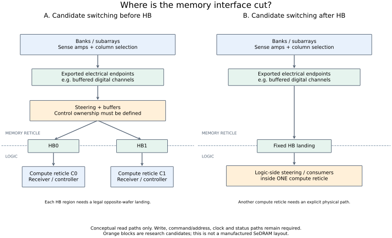

# Step 1：bank → HB 的真实设计自由度

当前先回答物理接口问题，不把 k=2、reciprocal pairing 或某个 DSE 结果当成既定架构。
[已完成扫描](SERVICE_DRIVEN_REPORT.md)已归档；其流体收益不能证明 DRAM-side fabric 可实现。

## 已知事实

**有设计自由度，但首先是“在哪一级切开 DRAM/logic、在哪一侧放外围电路”的自由度。**
不能把一个 bank 抽象节点直接当成可任意接长线的全速数字端口。

| 一手资料 | 已公开支持什么 | 没有由此证明什么 |
|---|---|---|
| SeDRAM，2023，§2.1 | 示例把阵列划成独立 channels，用各自的 128-bit RWDL；该接口为 full-swing，外围控制/I/O 放到 logic die | 任意 bank 可同时接多个远处 HB region |
| Micron US20230048628A1，Figs. 3C–3G | 披露 LIO/感放相关引出、mux，以及 transceiver 放在 memory 或 logic 侧的不同方案 | 跨 reticle pooling 已流片或达到低成本 |
| 同一专利，Fig. 2C 相关说明 | 提到 RDL 可适配不同 ASIC 接口布置 | 被动重布线具有仲裁功能或增加 bank 服务能力 |
| CPSIA，2024，§3 | 跨层路径由 DRAM/logic buffers 驱动，读、写和 command/address 路径都要处理 | 加一条拓扑边即可忽略驱动、负载和时序 |

来源：[SeDRAM 原论文](https://www.mdpi.com/2079-9292/12/5/1077)、
[Micron 原始专利披露](https://patents.google.com/patent/US20230048628A1/en)、
[CPSIA 原论文](https://www.mdpi.com/2072-666X/15/5/557)。
SeDRAM 有芯片实现证据；专利在这里仅作为结构披露使用，不视为量产或性能实证。
专利中的 256k connections / 1.2 μm 也是实施例，不作为本项目的默认物理参数。

## 推论：最简结构要区分“资源”与“导出的端点”

下面是供本研究讨论的层次图，不声称所有 DRAM 的信号命名、切分位置完全一致：

```text
DRAM array / bank / subarray
           ↓
sense amp + column selection
           ↓
local/global data path + 必要的放大/驱动
           ↓
可导出的电气端点（例如 buffered digital RWDL）
           ↓
可选的选择/复用/布线
           ↓
HB pads / regions
           ↓
logic 接收、控制与数据消费者
```

**“可选选择/复用”也可以在 HB 之后。** 因而首先不能把
`bank → sharing fabric → HB` 固定成唯一的物理结构。



图 A 是本研究可提出的 memory-side 数字交换候选，并非已验证芯片；图 B 表示
数据先过 HB 后在一个 logic reticle 内交换。它们改变的可达关系不同。

在沿用上游“同层不能直接跨曝光场连线”的系统假设时，C0 内的 logic-side 交换器
不能自动让 C1 使用同一源端点。必须画出第二 HB 暴露路径或显式的其他转发路径。
这是连通性推论，不是对所有 wafer 工艺的判断。
[上游 WoW 网络论文，§3](https://arxiv.org/html/2603.05266v1)。

## 哪些固定，哪些能设计，成本在哪里

下表是下一次最小模型的边界约定；“固定”指采用某个阵列宏时先固定，不是永久禁止修改。

| 层次 | 暂固定的输入 | 可研究的自由度 | 必须登记的代价/约束 |
|---|---|---|---|
| 阵列与感知 | 宏的组织、共享感知/行状态、原生服务能力 | 若改动则另列 array redesign 分支 | 不能由额外输出端口凭空增加内部并行度 |
| 导出端点 | 端点位置、信号电平、宽度、方向、服务上限 | RWDL/MIO 或更靠近 LIO/感放的切分位置 | 接口转换、驱动负载；更早的切分未必可直接用普通数字 mux |
| 数字连接 | 已选定的有效数字端点 | 固定重接、mux/demux、分组、buffer、交换电路所在层 | 数据线宽、线长、扇出、仲裁、缓冲、延迟 |
| HB | 对接窗口与双方 pad 配准要求 | region 位置、pad 数量、带宽分配 | 两端连接必须真实配对；曝光场 overlap 不等于 pad 已对齐 |
| 控制 | 每次 bank 操作有一致的控制状态 | 一个控制器共享出口，或多请求源先仲裁 | 读写数据、命令地址、时钟/状态都需要完整路径 |

这里关于成本和控制的条目是工程推论/待实现条件，不是假称从论文获得了工艺数值。
被动 RDL 可以改变落点；主动选择需要电路。把一条总线扇出给两处，还需要考虑接收
负载与请求归属，不能据此把 bank 服务率乘二。

因此目前合理的模型应多一层：

```text
bank resources → export endpoints → candidate wiring/switches → HB regions
```

当前代码的 `bank → port` 边把中间两步合并了；之后要明确每条边代表哪一种实现。
目前没有证据断言任意 bank-to-port crossbar 可低成本实现，也没有证据断言它不可能。

## 下一步问题

只选一个问题：**对于一个给定的 DRAM 数字导出端点，第二个 HB 出口需要新增哪些
电路和连线，能提供“择一访问”还是“独立并行访问”？**

先回答端点和通道的含义，再讨论 sharing graph。

## 最小实验：接口级连接账本，不做整片性能搜索

选一颗 memory reticle 中两个已定义的数字通道端点、两个候选 HB regions，画三份
带位宽与控制方向的连接图：原始一一连接、固定落点重布线、增加主动选择。
先比较它们的 pin/net 清单，不运行新的 36C+36M DSE。

每份只登记：导出点在何处、每周期最多输出多少 bit、请求如何取得 bank 控制权、
读写如何返回、增加多少 driver/mux/buffer/线/pad，以及哪些 wire 留在同一 reticle 内。
新增 pad 与固定 pad 两种预算都可以列出，不提前排除设计。

没有实际 DRAM 宏与工艺库时，先给符号宽度/距离和缺失参数清单；如用通用数字库做
后续原型，结果只证明那个数字实现的开销，不宣称等同 DRAM 工艺。
本轮已完成上面的文献与边界梳理；这三份 pin-level 原型尚未实现。

继续的第一项模型检查是 [partitioned / striped 的端点容量语义](SLICE_EXPOSURE_METHOD.md)，
不是重新启动 architecture DSE，也不取代上述 pin-level 原型。
