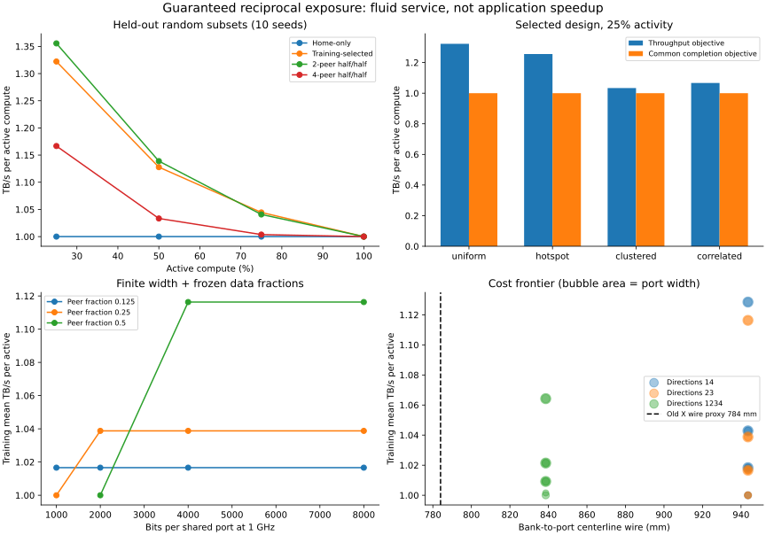
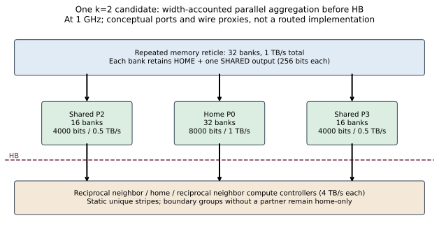

# 可保底双向 exposure：参照实验结果

这是开放 Memory Fabric DSE 的一个可解释参照，**不是把研究空间限定为 k=2 或零退步**。
在 eex005 完成 51 个配置、其中 41 个通过满载证书、2,880 条 held-out 记录。
实验代码 `710cb8b795f8c0878d72579d6e23179f3a4d8be1`；工作树干净；远端 21 项测试通过。
原始结果在 `memory_results/eex005_exchange_710cb8b/`；
[完整方法](GUARANTEED_EXCHANGE_METHOD.md)、[紧凑结果](guaranteed_exchange_results.json)。

## 得到了什么

同样的 36C+36M、每 M 1 TB/s、controller 4 TB/s，以及重复 H/plus 模板下，
保留 home、每 bank 再接一个共享口，能在静态唯一数据驻留下维持满载每 C 1 TB/s，
并回收部分稀疏活动带宽。几何独立重建得到 844.8 mm²、36 条 home 边、55 对互反邻接。
这些几何原语来自上游，不是新贡献。

按训练集选择、950 mm 线长预算和 16000-bit 总端口预算的胜者是方向 (1,4)、
half-home/half-peer、home 8000 bit、两个 shared 各 4000 bit。在 1 GHz 下是
1 + 0.5 + 0.5 = 2 TB/s 的实际端口配置，**上限预算**仍为 4 TB/s。
所有设计使用相同预算上限，不是声称实际 provisioned pins 完全相等。

| 25% 活动，独立测试 seeds 2000–2009 | 平均 TB/s/active | 公共完成 TB/s | 相同 fabric 免费重映射上界 |
|---|---:|---:|---:|
| Uniform | 1.3222 | 1.0000 | 1.5556 |
| Object hotspot | 1.2556 | 1.0000 | 1.5444 |
| Clustered | 1.0333 | 1.0000 | 1.2167 |
| Correlated | 1.0667 | 1.0000 | 1.2944 |

基线为相同几何、相同对象内条带能力的 home-only，以上各项均为 1。
所有活动客户端最低服务保持 1，全活动平均也是 1。随机 25% 的同 fabric
oracle 增益回收比例是 58%，不是相对于原先不同几何/自由接口的 2.47×。
公共完成始终为 1，**没有同步应用加速证据**。

Object hotspot 与 uniform 使用不同的活动子集（旧 generator 将 pattern ID 放进 RNG）。
对于完全相同的活动集合，这里的对象内均匀条带使对象权重抵消，二者必须相同。
因此表中差异来自活动集合，不是“热点被新结构解决”的额外收益。

## 结构和宽度比 degree 更有解释力

- 两方向 half/half 的所有等概率 9-of-36 子集精确期望为 **1.327731**；
  四方向仍为每 bank k=2，但下降为 **1.186211**。更多伙伴意味着更多固定必经 bank。
- 固定每个 compute 的边际活动率 50%，仅改变两阶段共同活动关系，方向 (1,4)
  与 (2,3) 的优劣翻转：适配的方向 1.5556，另一个 1.0000。
  这是联合活动统计有效的机制实验，不是实际 trace 的泛化结果。
- 用户提供的 2+1+1 TB/s 探针与缩减到 1+0.5+0.5 的版本，在本次共同测试场景
  具有相同功能吞吐。每 bank 256-bit 输出仍须并行汇聚，不能用一个 256-bit mux 代替。
- 共享口缩窄至 256 bits 时，half/half 满载证书失败；带宽并不是由连接数自动赋予。
- X/XY 的连续静态布局 LP 复核：严格满载 1 TB/s 时非 home 比例上界为 0。
  X 的保底改为 .99/.95/.9 时，上界分别为 2.525%/13.158%/27.778%。
  这是布局机会，不是已获得的性能收益；开放 DSE 将允许这些退步。

## 成本尚不支持“便宜”结论

| repeated memory template | bank-port 边 | 线长 proxy mm | 总配置端口 bits | 训练均值 |
|---|---:|---:|---:|---:|
| Home-only | 32 | 472.0 | 8000 | 1.0000 |
| 双方向 half/half | 64 | 943.6 | 16000 | 1.1285 |
| 四方向 half/half | 64 | 838.6 | 16000 | 1.0642 |

方向 (2,3) 的分配优化确实复现 **1266.1 → 943.6 mm，降低 25.47%**，
但仍比旧 X xor_1 的 784 mm 高 20.36%。在 784 mm 预算下，本候选族只能选择 home-only。
在 850 mm 下四方向可行，在 950 mm 下两方向更好，说明预算会改变结构选择。
这不是等面积胜利：home fan-in32、共享 fan-in16、pipeline/buffer、形状面积均需记账。

线长、wire-bit-mm、selector bit-input、每 2 mm 一级寄存器与深度 2 buffer 都是
配置代理。没有证明布线、时序、仲裁、面积或能耗。也未模拟逻辑侧内部路由成本。

## 复核与解释边界

结果 SHA256：`9f2ff8e3d01a5d00f4e42a5c303557f7b7c220d15bdbb177bf86084e80613f05`。
逐条检查唯一条带、存储容量、layout hash、最低服务、bank/HB/controller 上界、
静态吞吐不超过同 fabric oracle，以及按训练数据重算选择。
最大约束残差 **6.28e-15 TB/s**。严格探针 seeds 1000–1009 的 uniform 均值
独立复现 1.422222，但其余活动生成规则未获得原独立脚本：本实现 hotspot 1.266667、
clustered 1.000000、correlated 1.022222，不声称复现用户原脚本全部样本值。
精确总体均值比这 10 个 seed 更适合机制论证。

下一步已进入开放 DSE：允许非均匀 degree、非均匀宽度、静态布局共设计和 0/.9/1
服务水平。这里的参照说明固定数据共享有真实结构机会，但没有证明低成本、
同步加速或已排除既有工作。无需把这些未决点变成禁止探索其他结构的条件。
