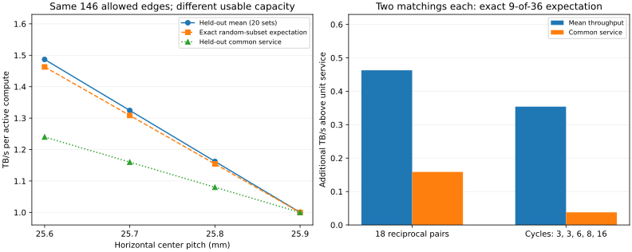

# Matching-aware placement：结构成立，但 matching 数量还不够

已在 eex005 完成结构复核和一轮受控 placement 实验。当前最有价值的结论是：
**满载平衡布局由 matching support 约束，而稀疏收益还取决于 matching 的交替环结构、HB 容量和混合比例。**
这轮没有发现新 contour，也没有证明新的 bank 电路；H/plus 来自上游。

## 1. 已知事实：独立复核了唯一匹配结论

| 几何 | C–M 邻接数 | 可进入某个 perfect matching 的边 | 最大边不相交 matching 数 | 平衡布局多面体维数 |
|---|---:|---:|---:|---:|
| Aligned | 36 | 36 | 1 | 0 |
| X | 66 | 36 | 1 | 0 |
| XY | 121 | 36 | 1 | 0 |
| H/plus | 146 | 146 | 2 | 75 |

用了两种独立判定：交替图的强连通分量，以及强制每条边后对剩余 35C/35M 求匹配。
最大边不相交数通过 k-factor 最大流得到，未用贪心删除匹配冒充最大值。
这里没有计算所有 perfect matching 的总数；“两套”指最大边不相交 packing。

令 A[c,m] 为固定字节比例。36 个行和均为 1，满载每个 C 服务 1 TB/s，
每个 M 服务上限 1 TB/s，则每个列和不超过 1。行列总和相等，迫使所有列和也为 1。
A 因而是双随机矩阵，可写成支持图中 perfect matchings 的凸组合。
唯一 perfect matching 就强制了唯一满载平衡布局。

这是已有 Birkhoff–von Neumann 理论在本问题中的应用，不是新图论定理。
等数量、等服务能力、饱和满载、无复制/转发和固定字节比例是上述推论的条件。
降低保底或改变资源配比时应使用更一般的运输模型，不能直接沿用唯一匹配结论。

## 2. 最小 placement 实验：matching support 相同，收益仍然不同

固定两层重复模板、36C+36M、每个 reticle 844.8 mm²、五个 0.4×8.25 mm
HB 区域、每端口 0.8 TB/s、每 reticle 总 HB 4 TB/s、每 M 服务 1 TB/s、
每 C controller 4 TB/s。只改两层共同使用的水平中心间距与交错列偏移。

15 个候选中，7 个通过当前 polygon/region 检查，8 个因同层 reticle 重叠被拒绝。
这只是一个有限的排布空间；没有声称搜索了所有 wafer 相对位移、轮廓和接口设计。

下表四个候选均有 146 条可用 matching 边、75 维平衡布局空间，以及两套最大
边不相交 matching。训练选中 home + reciprocal permutation，后者包含 18 个配对。

| 水平 pitch，mm | 单条共享 HB 容量 | 选中的 home / peer 字节比例 | 满载公共 BW | 随机 9/36 精确平均 BW | 20 个测试集合平均 BW |
|---|---:|---:|---:|---:|---:|
| 25.6 | 0.8 | 1/2 : 1/2 | 1.000 | 1.462857 | 1.486667 |
| 25.7 | 0.6 | 4/7 : 3/7 | 1.000 | 1.308571 | 1.324444 |
| 25.8 | 0.4 | 2/3 : 1/3 | 1.000 | 1.154286 | 1.162222 |
| 25.9 | 0.2 | 4/5 : 1/5 | 1.000 | 1.000000 | 1.000000 |

带宽均为 TB/s，平均值按 active compute 归一化。共享容量下降来自区域 overlap
变小，不是减少已配置 HB 预算。上述四个 matching graph 在拓扑上相同。

尤其是 pitch=25.8：固定 50/50 只能满载达到 0.8；改成 2/3 : 1/3 可恢复到 1。
所以应设计 **capacitated matching mixture**，不能只最大化可用边或一律等分数据。

pitch=26 时只剩 home 边，本轮固定端口配置下最多服务 0.8。这是 placement 消融，
**不是最优 home-only 基线**：未重新分配端口面积/带宽。矩形 Aligned/X/XY 的面积
和端口数不同，也只用于结构诊断，不能拿来宣布等成本性能胜出。

## 3. 同样两套 matching：交替环结构也重要

在原 H/plus placement 和相同 50/50 字节比例下比较两种构造：

| matching 的相对置换结构 | 随机 9/36 精确平均 BW | 精确平均公共 BW | 满载 BW |
|---|---:|---:|---:|
| 18 个双向配对 | 1.462857 | 1.158652 | 1.000 |
| 环长 3、3、6、8、16 | 1.353950 | 1.037702 | 1.000 |

这里环长按 compute 数计数；一个两 compute 配对对应二部图中的四边交替环。
所有 matching 和数据比例在测试前冻结，测试阶段不换配对、不迁移、不复制。

原因可以精确解释。每条 HB 容量 0.8，50/50 布局使单个 compute 的独占速率
最多为 1.6。存在共同使用其必经 memory 的 active compute 时，保底 1 约束迫使
双方维持 1。双向配对只有一个竞争伙伴；较长环中，每个 compute 有两个竞争伙伴。

对随机选出的 9 个 active compute，配对方案的精确期望为：

\[
1+(1.6-1)\frac{27}{35}=1.462857.
\]

较长环方案则为：

\[
1+0.6\frac{\binom{33}{8}}{\binom{35}{8}}=1.353950.
\]

公共带宽只有在 active 集合不包含任何互相竞争的节点时才升到 1.6。
配对方案该事件概率是 \(2^9\binom{18}{9}/\binom{36}{9}\)，故平均公共带宽
为 1.158652。长环方案用环的独立集计数得到表中精确值。
这也说明不能把更多 matching 或更长的环自动视为更好的静态共享结构。

20 个测试集合给出的配对平均公共 BW 是 1.24，高于精确期望 1.158652。
因此本报告以精确随机子集期望作为主结论，没有用偏高样本均值宣传收益。

## 4. 空间活动模式仍然限制收益

原 H/plus、训练选中的配对布局，20 个独立测试 seeds：

| 场景 | 平均 BW | 平均公共 BW | 最差样本平均 BW |
|---|---:|---:|---:|
| 随机 25% | 1.486667 | 1.240000 | 1.333333 |
| 随机 50% | 1.310000 | 1.000000 | 1.200000 |
| 集中 25% | 1.160000 | 1.000000 | 1.066667 |
| 空间相关 25% | 1.220000 | 1.000000 | 1.066667 |
| 全活动 | 1.000000 | 1.000000 | 1.000000 |

集中/相关模式仍无公共完成改善；平均吞吐不能代替同步应用加速。
最短距离配对和确定性的非 home 匹配在这次构造中得到相同配对，不能当成两份
独立算法收益。训练只选有限候选和比例，没有求全局最优 placement/layout。

## 5. 本轮证明到哪里，下一问是什么

本轮服务模型保留了固定 C→M 字节比例、memory/controller、两端 port 和每条
overlap 的容量，但 memory 内部仍然允许 pooled access。它是 **reticle-level
静态服务放松模型**，没有证明对应的 bank/LIO exposure fabric 已经实现。
特别是前一轮发现的固定 slice 带宽、共享父 bank 上限和 word/address 语义不能删除。

所以目前可以支持的研究对象是：

**placement → 可用 matching support → 带容量与竞争关系的 matching mixture → 固定数据布局。**

下一步最小问题是：将这里的两套 matching 投影到重复 bank/slice-to-port 模板时，
能否在相同 bank 服务和端口宽度下保住这些速率？先比较配对与长环各一个候选，
输出具体 bank exposure 和通道需求。若同一 repeated template 无法实现，要明确
指出是哪一段通道/地址语义限制了服务，而不是通过自由重放数据绕过去。

这并不把后续设计空间锁死成严格保底或 k=2。本轮使用保底 1 只是为了隔离
matching 结构的因果作用；其他服务目标仍可以研究 Pareto tradeoff。

## 6. 复现与证据

- 代码提交：`2ad20db263c76d1167a5febba7c9b7b8d01de716`；eex005 开始时工作树干净。
- 15 个 placement 候选、75 个布局候选；训练 seeds 91000–91007，测试 92000–92019。
- 810 个测试配置，各自单独求吞吐和公共服务；实验耗时 28.84 秒。
- 本地和 eex005 各自通过相关 13 项测试。
- 下载原始结果 SHA256：`d3738284da5cf7dd5a3ede89d58b6bdeaacb30084b999ad01b2d22943bff7648`。
- 不调用 LP 的独立复核重新构造每条 C–M 流和 port 负载，最大约束偏差
  `7.09e-14` TB/s；50/50 闭式服务结果与求解器最大偏差 `2.56e-14` TB/s。
- `matching_placement_results.json` 保存原始候选、选定 matching 和逐场景 rates；
  `matching_placement_summary.json` 为汇总，`analyze_matching_placement.py` 可重建检查和图。

本轮使用连续 LP 和整数网络流算法；没有新增 Gurobi ILP。前者处理冻结布局后的
服务，后者求 k-factor，不应统称为 ILP。Gurobi 后续可以用于离散 matching/接口选择。

来源：[上游 H/plus 几何，§4.2](https://arxiv.org/html/2603.05266v1)；
[perfect matching 与双随机矩阵分解算法](https://arxiv.org/abs/0909.3346)。
这两个已有部件均不作为 novelty；与其他 HB 工作的完整方法重合仍未排除。

进一步的机制解释、环长结论修正及完整优化问题见
[MATCHING_THEORY_FORMULATION.md](MATCHING_THEORY_FORMULATION.md)。
