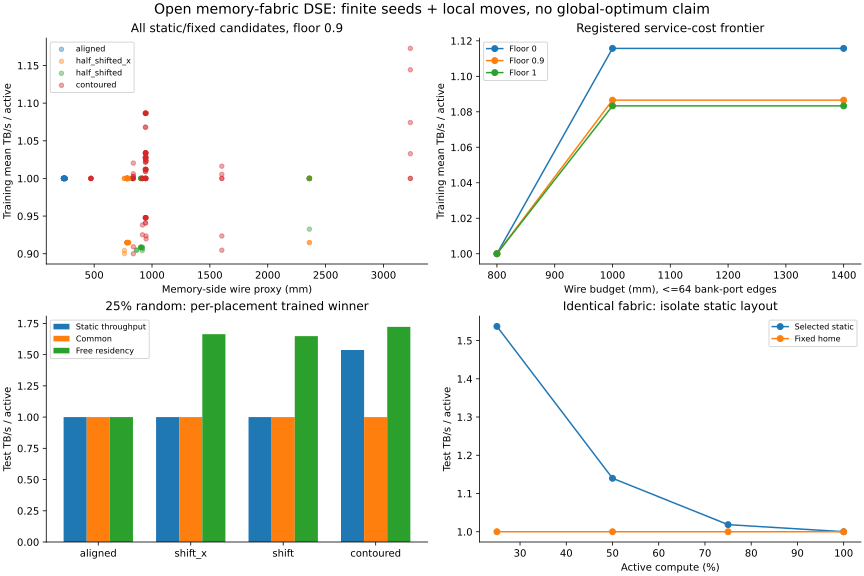

# Wafer-scale Memory Fabric：首轮开放 DSE

**设计空间已打开；这一轮找到的有效结构仍是平衡双向 exposure，尚未发现胜过它的
非均匀硬件新结构。** 几何、bank graph、端口宽度和静态布局现在都是候选变量，
服务约束比较 0 / 0.9 / 1 TB/s，旧的严格保底实验只是一个参照。

在 eex005 完成 **68 个硬件候选、293 个候选—布局组合、1,824 条独立测试记录**；
25 项测试通过。实验提交 `42250a95a3028b9c2b1f9bd6ea066ee2a4781a1f`，启动时工作树干净。
训练 seeds 300–301，最终测试 seeds 4000–4005；所有选择在测试求解前冻结。
[方法与搜索边界](MEMORY_FABRIC_DSE_METHOD.md) ·
[完整汇总](memory_fabric_dse_results.json) ·
[严格保底参照](GUARANTEED_EXCHANGE_REPORT.md)。

## 研究结果

在不超过 64 条 bank-port 边、1000 mm memory-side wire proxy、总 HB 4 TB/s
的注册预算下，三个服务水平都选择 `d028`：H/plus、方向 (1,4)、每 bank 两个输出、
half-home/half-peer 静态驻留。总 DRAM service 仍为 36 TB/s，controller 每 C 4 TB/s。
这是有限候选中的胜者，不是全局最优。

| 25% 活动，新测试均值 TB/s/active | 无最低服务 | 最低 0.9 | 最低 1.0 | 同 fabric 免费重映射上界 |
|---|---:|---:|---:|---:|
| Uniform | 1.5370 | 1.5370 | 1.5370 | 1.7222 |
| Object hotspot | 1.3333 | 1.3333 | 1.3333 | 1.5741 |
| Clustered | 1.1481 | 1.0815 | 1.0741 | 1.2500 |
| Correlated | 1.0556 | 1.0222 | 1.0185 | 1.2870 |

同一 fabric 固定 home 布局四项均为 1；上表静态布局没有复制或运行时移动。
所有档位的公共完成带宽均为 1，满载平均和最低服务也均为 1。
所以这里看到了不均衡需求下的吞吐机会，**没有看到同步阶段加速**。

**1.5370 是 6 个独立随机子集的均值，不能当作总体期望。** 对这个平衡两方向结构，
所有等概率 9-of-36 子集、每活动 C 至少 1 TB/s 的精确均值仍为 **1.327731**。
这次样本明显偏高；旧参照 10 个独立测试 seeds 得到 1.3222。两组样本不混合选优。
Object hotspot 与 uniform 的活动集合不同；对象内均匀条带假设下，相同活动集合的
两种对象权重必须给出相同结果。这里不是对真实 bank 热点的验证。

无保底求解返回的部分客户端服务为 0。但吞吐最优解可能不唯一，不能把该向量解释成
“必须饿死某客户端”：例如本组 uniform 在最低服务提高到 1 时总吞吐完全相同。
Clustered/Correlated 的总吞吐才实际表现出服务—吞吐折中。最低 0.9 档的 uniform
平均 P5 为 0.98、观察到的最低为 0.9；这些都是功能服务量，不是时延 SLA。

## RQ1：radix 与 usable flexibility 之间缺了什么

同一个 `d028` 硬件，home-only 为 1，平衡静态布局高于 1，免费重映射又更高。
因此必须分别讨论物理可达、bank exposure 和固定字节驻留。

以最低 0.9、25% uniform 的本组样本为例：

- 完全 pooling 的需求受限上界：36 TB/s，即每活动 C 4。
- 同一 fabric 的免费驻留上界：15.5 TB/s，即每活动 C 1.7222。
- 静态布局实际服务：13.8333 TB/s，即每活动 C 1.5370。
- 图/通道造成的上界缺口：20.5 TB/s；固定驻留额外缺口：1.6667 TB/s。

相对 home 基线，回收了同 fabric oracle 增益的 **74.36%**，但只回收整片完全
pooling 潜在增益的 **17.90%**。不能把这两个分母混用。最后一个比例也受本次
随机样本偏高影响；严格保底的精确总体增益对应全局潜力回收约 **10.92%**。
LP 返回的前 8 个非零容量对偶约束在上述场景主要是 bank service；这是一组
局部敏感性诊断，不能替代完整 cut 证明或宣称所有 HB 容量永远不重要。

## RQ2：同一预算下什么 graph 更好

本轮的答案是：**结构化平衡共享优于当前通用布局投影和局部图修改启发式**。
在同一 `d028`、最低 0.9 的训练分布上：

| 布局候选 | 训练平均服务 |
|---|---:|
| Fixed home | 1.0000 |
| 活动互补目标的 L1 投影，设计保底 .9 | 0.9478 |
| 同一投影，设计保底 1 | 1.0338 |
| 平衡 peer fraction 1/8 | 1.0119 |
| 平衡 peer fraction 1/4 | 1.0278 |
| 平衡 peer fraction 1/2 | 1.0866 |

这说明“根据 activity correlation 分配更多非 home 数据”还不够。
L1 接近一个互补性目标，并不等于最大化固定数据流吞吐；一小份必经 bank 数据就可能
限制整条流。下一种算法应该直接用固定数据服务 LP 的瓶颈反馈更新布局和连边，
而不是把 affinity score 当成最终性能目标。

修订后的局部搜索继承父设计所有静态布局，避免因为重新放置不好而误伤一个有用的
连边修改。但在 64 边/1000 mm 预算下，edge move 和 width move 仍没有严格胜过
结构化 seed。**因此不能把这轮吞吐收益写成通用 synthesis algorithm 的贡献。**

取消线长/连边预算筛选后，训练最优可达到 1.1727（最低服务 .9），但需要 H/plus
完整 k=5、160 条连接和 3232.4 mm wire proxy。这是训练集高成本候选，未进入注册
成本预算的 held-out 胜者集，不能拿它与测试均值直接排序。

选中结构的线长是 943.6 mm、fan-in 为 32/16/16。当前开放 DSE 为控制总资源，
所有 q 向量都配置满 4 TB/s；选中向量为 `[8000,6000,6000,6000,6000]` bits，
其中两个端口没有 bank 输入，说明吞吐目标下存在宽度冗余和等价解。
严格参照已表明同类结构用 2 TB/s 配置即可获得相同功能吞吐。因此它不是最省 pin
的解；下一步应把已配置宽度的 Pareto 目标与 throughput 并列，而非只要求用满预算。

## RQ3：placement 与 bank graph 是否需要联合考虑

同一注册 64 边/1000 mm/4 TB/s 预算、最低服务 .9 下，Aligned、X、XY 各自训练
选出的静态方案均为 home mapping，测试平均为 1；contoured 选择平衡共享并有收益。
几何确实改变了这个候选集合中可用的静态共享结构，单给 aligned 更多 bank edges
不会产生跨 memory-reticle 访问。

但这还不是“全局联合优化必要性”的证明：候选几何有限，布局优化仍是启发式，
H/plus 与矩形的形状/面积和接口组织也不同。相同 reticle 数消除了数量差异，
没有消除全部物理成本差异。共同活动互补实验另外证明，边际活动率相同也能改变
最优共享方向，详见参照报告。



## 下一步方法焦点

保留开放图空间，优先改进 **bank group 与固定驻留比例的联合更新**：继承已知好布局，
用实际服务瓶颈选择少量连接/比例交换，并在相同吞吐下压缩冗余端口宽度。
当前现象不支持盲目加 degree，也不支持“非均匀一定更好”；应让实验区分哪些结构
降低了必经 bank 冲突，哪些只是增加几何机会。

本轮非均匀 bank-degree 种子没有真实“热 bank”证据：所有对象共享同一条带比例。
开放 DSE 的通用布局使用连续字节比例，尚未量化成可实现的地址映射；平衡构造则在
严格参照中已有有限条带表达。真实对象内偏斜、页粒度和 trace 是后续评价问题。
不把它们的缺失当成禁止提出新结构的条件，也不把流体结果写成应用加速或芯片 PPA。

## 可复核记录

原始数据：本地和 eex005 的 `memory_results/eex005_dse_42250a9/`。
`records.jsonl` SHA256：`1d3851ac38370431f50b5429edea7365e3456fe9576fb9fb99fe497535af0dd0`。
验证覆盖字节/存储守恒、冻结布局 hash、训练/测试分离、训练选择重算、各服务档位
和 oracle 上界；最大残差 **3.67e-15 TB/s**。

初次 `46ecc01` 的 64-candidate 运行因局部图修改未继承父布局，仅保留作方法诊断。
修订后使用新测试 seeds，未在旧测试集上继续选优。独立探针 ZIP 未获得；本研究
按用户给出的参数重建，没有声称运行其原脚本。

```sh
OPENBLAS_NUM_THREADS=1 OMP_NUM_THREADS=1 .venv/bin/python run_memory_fabric_dse.py --output memory_results/reproduce_dse
OPENBLAS_NUM_THREADS=1 .venv/bin/python analyze_memory_fabric_dse.py memory_results/reproduce_dse
```

H/plus、页内交错、bank sharing 本身不申报为创新。与 SiloBreaker 的全文方法重合
仍未排除；当前候选贡献是 repeated-reticle 几何约束下的 memory-fabric 联合设计，
具体有效算法和物理收益还需要由后续结果支持。
