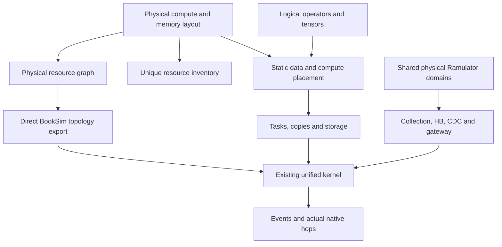

# Architecture V3

The research question is where vertically supplied DRAM data enters an existing
distributed compute wafer, which compute/SRAM resources consume it, and how much
lateral communication that organization requires.

`WaferStack` owns regions, clusters, routers, DRAM domains, vertical ports,
gateways and collection paths. An immutable budget prevents a split from silently
adding compute, SRAM, native service, lanes or buffers. Additional resources
require a new declared budget and machine identity. Bank groups are address views;
overlapping views add no physical capacity. Different content cannot overlap
through those views. Declared aliases still share one native service.

Reticle regions do not execute tasks. Clusters execute; routers forward.
The first layout has four clusters and 32 native domains per paired region.
Router and cluster counts can differ. The first compiler requires co-located
cluster/router attachments; remote attachments require a separately modeled
path. Gateways have positions and a timed connection to their selected router.
A central landing does not have free connections to every cluster.

Fabric channels compose intra-region segments and a short boundary stitch.
An aggregate channel represents a fine-route bundle with explicit cut bandwidth
and hop/pipeline counts. Frontend routes establish legal reachability; native
link arrivals establish executed paths. The memory layer has no lateral routers.

One logical input tensor can have many consumers. Lowering explicitly selects
physical copies and lifetimes. The first implementation materializes conservative
per-consumer copies and claims no multicast/alias-reuse savings. Gate/up GEMMs
complete before SiLU; down projection uses the completed gated activation.
FP32 partial results are reduced before BF16 outputs enter token combine.
