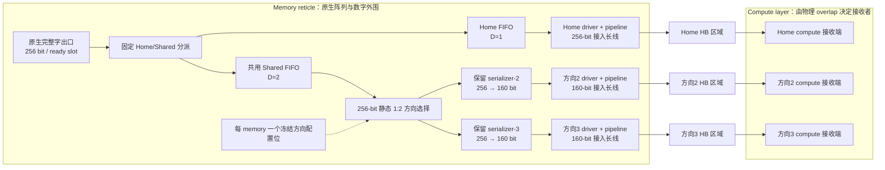

# Configurable Shared Egress：固定方向的共享缓冲

2026-10-07；源码 `7604acb`，eex005；输入为架构竞争 `806fe82` 的冻结结果。

**在相同 placement、物理方向、配对、静态数据、接口位宽和 workload 下，A/B 共用一个
Shared FIFO 后保持原服务，endpoint 存储分别减少 33.3% 和 40%。** 保留每方向 serializer、
驱动、长线、HB 和 pipeline。本轮完成数字模型中的显式架构与服务验证，尚无 RTL/PPA。

研究主线收敛为：为 repeated-reticle WoW Memory-on-Logic 设计低成本共享接口。
Matching/静态布局给出冻结伙伴，完整字执行验证服务，成本账本解释开销。
暂不扩展 matching/cycle、任意 k、FIFO 深度或 DSE 方法。

## 1. 本轮只改变一件事

独立出口基线每 bank 制造 Home、Shared-2、Shared-3 三个 FIFO。可配置版本制造 Home
和 Shared 两个 FIFO，在数据布局冻结时将 Shared 连接到方向 2 或 3；运行时不换伙伴。
两个候选都使用原来的 18 对，18 个 memory 选择方向 2，另外 18 个选择方向 3。

实现入口为 `static_shared_fifo(design)`；它从**完整冻结布局**编译方向，而不是从当前
activity set 推断。`EndpointSpec.shared_fifo_ports` 描述共用队列的物理出口，
`MemoryFabricDesign.shared_directions` 保存每实例配置。

执行器实际创建一个共享队列，保留每个物理端口的完成/发送计数。布局使用第二个方向时
直接拒绝，Service envelope 同时将未选择 bank-output 的服务容量置零。物理路线和配置
HB 不删除，成本模型对共享存储只计一次，并单列方向选择器。

这利用的是**制造时需要支持多种配置，执行时只需兑现已选配置**。相同电路模板可以搭配
不同实例配置；不需要让每个实例同时服务所有制造方向。

## 2. 可检查的物理路径

下图是一颗 bank 的 B 候选。拟议新增电路位于 memory reticle 的数字外围区域；这是本轮
架构放置假设，不是已完成工艺映射。原生 256-bit 边界是模型定义，未等同某款 DRAM 的 RWDL。



两个 shared 分支的电路和线路都存在，只有选中分支接收数据。选择发生在第一次 HB 之前，
HB 后直接到达合法接收者，没有跨 compute 转发。Serializer 置于长线之前，所以长线按
160 bit 计；方向选择器之前的局部连接为 256 bit，长度尚未知，单列而不计为零。

本轮保留两套 shared serializer，专门检验 FIFO 复用。进一步合并发送电路应作为另一项
明确的实现对照，不能直接从存储减少推断 driver、线长或 serializer 也减少。

## 3. 相同服务下的成本变化

以下均为每 memory 的完整制造模板。全体设计满载每 C 为 1 TB/s；random9 保留完整 36C。

| 设计 | random9 TB/s/C | Endpoint bits | Pipeline bits | Lane bits | Wire bit-mm |
|---|---:|---:|---:|---:|---:|
| Home direct | 1.000000 | 8,192 | 63,488 | 8,192 | 120,832.0 |
| k2 direct | 1.327731 | 8,192 | 126,976 | 16,384 | 241,561.6 |
| k3 A，独立 FIFO | 1.385714 | 24,576 | 155,904 | 16,384 | 297,497.6 |
| **A，可配置 Shared FIFO** | **1.385714** | **16,384** | **155,904** | **16,384** | **297,497.6** |
| k3 B，独立 FIFO | 1.482143 | 40,960 | 179,008 | 18,432 | 341,664.0 |
| **B，可配置 Shared FIFO** | **1.482143** | **24,576** | **179,008** | **18,432** | **341,664.0** |
| k3 full-width direct | 1.771429 | 8,192 | 248,320 | 24,576 | 474,163.2 |

A=256/128/128、D111、home 比例 2/3；B=256/160/160、D122、home 比例 8/13。
Direct 的 8,192 bits 是每 bank 一个共享原生字寄存器，不能当成无存储。

\[
B_{independent}=32\times256(D_H+2D_S),\qquad
B_{configurable}=32\times256(D_H+D_S).
\]

A 节省 8,192 bits，B 节省 16,384 bits。Endpoint+pipeline 两项存储合计分别减少
**4.539% 和 7.448%**。新增成本为每 memory **32 个 256-bit 输入、512-bit 合计输出的
静态 1:2 选择器**，一个广播方向配置位；选择器与本地布线尚未换算面积。
64 个 shared serializer（每 bank 两个）以及相应驱动和外部路径均保留。

因此，相对于同位宽的独立出口，主成本表中的存储维度改善；加入未定价选择器后的完整
硬件成本是否严格占优，仍需实现计数。不能声称整个芯片节省 33%/40%。

“保留大部分 sharing benefit”也要说明参照：本候选保留**同位宽独立 FIFO 基线的全部服务**；
相对 full-width direct 的增量带宽，A/B 分别回收 50%/62.5%，而非接近全部。
相对 k2 direct，A 仍需两倍 endpoint bits 和多 23.16% wire；B 需三倍 endpoint bits
和多 41.44% wire。因此 k2 仍是必要的低成本对照。

## 4. 为什么服务可以保持

对一个冻结 memory 实例，独立实现中未选方向的队列始终为空。将旧 Home 队列、选中 Shared
队列映射到新 Home/Shared 队列，原生准入条件、队列容量、发送预算和下游 credit 都一致。
每一步状态转移保持对应，故固定方向下的完成序列相同；这也说明该等价性不依赖偶然的
测量窗口。代码仍逐槽检查守恒，并寻找首尾相同的周期状态。

两个 A/B 基线共有 10 类实际序列。Home-only 在两种配置下各验证一次，因此正式候选共
完成 **12 次配置轨迹比较**：完成字数、发送位数、瞬态、周期、反压、队列峰值均相同，
周期边界按队列映射也相同。单元测试另外覆盖 credit 停顿。

边界反例保留：两个独立 160-bit Shared 输出交替接收字可合计达到 1 倍原生速率；强行
折叠到一个口只有 .625。正式实现会拒绝同时引用两个方向的序列，而不是在此情形下声称等价。

## 5. k2 的不足分成两部分看

从实际数据所有权找出 16 个包含 private-bank 必需字节的 compute，其余 20 个依赖两个
共享伙伴。所有统计仍使用完整 36C 的 random9；并未删除边缘请求或改变激活概率。

| 冻结设计 | 20 个无 private 瓶颈 C | 其余 16 个 C | 全体平均 |
|---|---:|---:|---:|
| k2 direct | 1.589916 | 1.000000 | 1.327731 |
| k3 A / configurable A | 1.385714 | 1.385714 | 1.385714 |
| k3 B / configurable B | 1.482143 | 1.482143 | 1.482143 |
| k3 direct | 1.771429 | 1.771429 | 1.771429 |

令 P1=27/35、P2=27×26/(35×34)，两种 direct 构造的平均差可按当前公式分解为：

\[
1.771429-1.327731
=\underbrace{P_1-P_2}_{0.181513：一个与两个伙伴的空闲概率差}
+\underbrace{\frac{16}{36}P_2}_{0.262185：当前 private 覆盖项}.
\]

这是一种明确的代数分解；不是已实现“免费修复边界”的架构，也不证明任意数据组织都受
同样数值限制。它足以说明后续 k2 投入应针对必要字节的覆盖和伙伴依赖，继续加宽现有
direct 出口不会解除这些约束。

## 6. 验证与复现

- **22 项测试通过**：前轮 18 项，加共享队列/credit 等价、反例、2C2M 服务成本、完整布局
  多方向拒绝四项；不额外扩展深度或 placement 测试。
- **7 个设计、147 个场景回放、441 个 LP**：每设计 full、single、one_pair、注册 random9、
  first9、全部 16 个 cluster；每场景吞吐、common completion 和流体上界各一次。
- A/B 各场景的每 C 服务、均值、common 和原物理组合证书保持一致。冻结 random 配对在
  cluster 上分别为 1.166667/1.208333，旧/新相同；没有借用重新优化后的 cluster 配对。
- 五个未修改基线的原有成本字段及 random/cluster 服务与归档一致；最大资源残差
  **6.28×10⁻¹⁵**。实验运行约 15.5 s。

```sh
OPENBLAS_NUM_THREADS=1 OMP_NUM_THREADS=1 /home/wangziheng/Video/w2w-memory/.venv/bin/python -m unittest tests.test_design_contracts tests.test_role_interface_regression -v
OPENBLAS_NUM_THREADS=1 OMP_NUM_THREADS=1 /home/wangziheng/Video/w2w-memory/.venv/bin/python -m w2w run_static_shared_fifo --output memory_results/static_shared_fifo/results.json
```

[原始结果](../../artifacts/results/endpoint/static_shared_fifo.json.gz)包含冻结方向、所有周期
见证、逐客户端精确期望和 LP 回放；[溯源与哈希](../../artifacts/provenance/static_shared_fifo_manifest.json)、
[测试日志](../../artifacts/provenance/static_shared_fifo_tests.log.gz)。

## 7. 研究判断与下一步

Configurable Shared Egress 是清楚的接口架构候选：静态数据与伙伴关系成为减少重复
服务硬件的依据。当前已证实其中“固定方向复用 FIFO”的数字机制；完整成本优势还需要
把选择器、本地接线和保留的发送电路画到同一实现口径。

下一步集中在这一条接口路径的实现成本与服务对照，优先确定选择器/serializer/driver 的
实际位置和开销；暂缓新的 matching/cycle、更多 k、深 FIFO 扫描和 BO/Benders/DSE。
Placement 与真实 trace 留待接口机制稳定之后。不能用扩大搜索空间代替这项架构验证。
