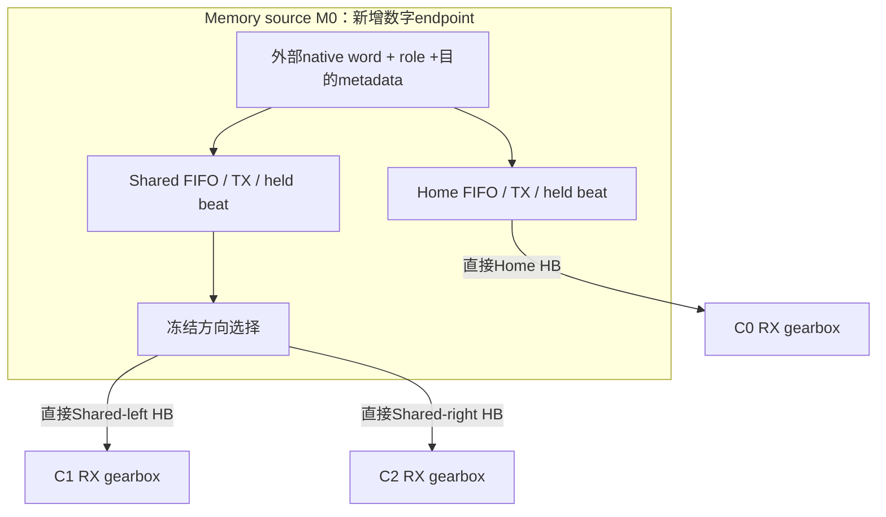

# Source-side Shared Egress：完整字经过TX、HB与RX的最小验证

2026-10-07；实验源码 `2745632dfc7f5a8497aa73c6b41125154e9f5595`，eex005，37.33秒。
方法与事先固定的测试集合见 [ENDPOINT_ROUNDTRIP](../methods/ENDPOINT_ROUNDTRIP.md)。

**256/160-bit、D=1/2的可配置出口，在固定单一Shared伙伴的全部注册轨迹中，
与独立出口逐周期等价；所有已接受的完整字在正确RX逐bit恢复。**
计入发送握手寄存器和三个物理RX后，payload存储从2,880降至2,208 bit，减少23.33%。
这是声明寄存器位数的比较，尚无面积、频率、功耗或长线时序结论。

## 1. 物理边与新增接口

最小星形取自既有H/plus几何的memory编号1，三个真实HB connector交集面积均约3.3 mm²。
别名仅为方便阅读，不新增连接：

| 最小系统 | 原compute编号 | Memory port | Compute port |
|---|---:|---:|---:|
| M0 → C0，Home | 1 | 0 | 0 |
| M0 → C1，Shared-left | 8 | 2 | 3 |
| M0 → C2，Shared-right | 0 | 3 | 2 |

两个Shared物理分支都制造，单一实例按配置使用一个。三个compute之间没有任何连接。
独立基线将Shared一支替换为Left/Right各自FIFO、TX和held beat；其余相同。
新增逻辑的功能位置在HB之前的source侧，不声称已证明DRAM工艺上的实现效率。

`native_role`由数据映射输入，`native_shared_direction`是目的metadata；独立基线支持
两个目的地，可配置版本仅接受与冻结cfg一致的Shared方向。本轮每个epoch只用一个方向。
RTL不生成8:5序列、不改变对象驻留；序列由testbench提供。没有array/controller/NoC RTL。

## 2. 修复的合同缺口

旧packetizer使用当槽credit。新 `endpoint_tx` 在它之后增加一个elastic beat寄存器，
使HB端的valid、payload、有效单位数在反压时保持。可配置结构的这个寄存器也共用，
静态方向选择位于其后。它在整字FIFO的D之外，成本单独计算。

`endpoint_rx`重组成256-bit完整字，接收后再交给compute的ready/valid接口。
RX能同时交付一个完整字、接收一个新beat；停顿时完整输出保持。
160-bit链路允许同beat包含前字尾和后字头；尾部不足整beat时携带有效32-bit单位数。
接收端按有效单位更新reservoir，忽略填充位，有限流不需要额外输入字才能排空。

每条HB流当前有一个原生源且保持顺序；debug tag编码在synthetic payload低32bit中，
其原始索引、目的端和全部256bit在scoreboard检查。真实多bank聚合的request ID、reorder、
额外metadata协议尚未实现，不能从本实验推定其成本为零。

## 3. 完整字正确性和服务

两个架构在同一testbench中并行运行，共用完整word序列、source offer机会、配置和RX背压。
每槽比较native ready、HB valid/ready/payload/units和RX输出；同时独立检查：

- 接受的每个tag在正确目的端恰好一次、有序恢复，256bit全部一致。
- native、HB、RX在`valid && !ready`时保持数据与控制字段。
- FIFO与RX容量、未选方向静默、cfg在epoch内固定。
- `256 × accepted = 256 × RX delivered + TX/FIFO/held-beat/RX中未交付的有效位`。
- 所有输入结束后，全部word排空；不存在未计的残留位。

共**26条成对轨迹、52个架构运行、301,559个成对周期**。
每个架构接受并正确恢复**208,102个完整字**，无差异。
主B的14条轨迹覆盖左右配置、home-only/shared-only/8:5 mixed、native burst、随机背压、
连续400槽的Shared接收停顿及17字有限尾部。其余12条为128/192/256 gearbox回归。
故意改变cfg、故意向scoreboard注入一个错误bit，两条负例均触发指定失败。
这是有限轨迹仿真与时钟采样断言，不是形式验证对所有输入的证明。

以下速率均在**RX交付完整word**处测量，warmup 1,040槽，测量8,320槽；单位word/cycle。
本次列出的速率与Python周期执行值完全一致。

| Shared width / D | 输入 | RX Home | RX Shared | 合计 |
|---|---|---:|---:|---:|
| 128 / 1 | shared-only | 0 | 0.500000 | 0.500000 |
| 192 / 1 | shared-only | 0 | 0.500000 | 0.500000 |
| 192 / 2 | shared-only | 0 | 0.750000 | 0.750000 |
| 160 / 2 | shared-only | 0 | 0.625000 | 0.625000 |
| 160 / 2 | 8 home : 5 shared | 8/13 | 5/13 | 1.000000 |
| 160 / 2 | home-only | 1.000000 | 0 | 1.000000 |
| 256 / 1 | shared-only | 0 | 1.000000 | 1.000000 |

192/D1测试是该单流下的串行占用回归，不是整片“192 direct”实现的PPA。
本轮没有重跑wafer LP；不能把这些single-slice计数直接称为新的全wafer TB/s结果。
RTL功能时钟单位任意，word/cycle不证明1.024ns、500MHz或1GHz时序闭合。

## 4. 把新增握手和RX存储算进去

下面为一个native source slice及其三个物理RX。Home256、Shared160，整字深度1/2。
配置未用的Shared RX仍保留，两种架构的RX实现完全相同。

| 状态/资源 | 独立出口 | 可配置出口 | 差值 |
|---|---:|---:|---:|
| TX whole-word FIFO payload bits | 1,280 | 768 | −512 |
| TX held-beat payload bits | 576 | 416 | −160 |
| 三个RX reservoir payload bits | 1,024 | 1,024 | 0 |
| **全部payload存储 bits** | **2,880** | **2,208** | **−672（−23.33%）** |
| TX控制寄存器 bits | 26 | 16 | −10 |
| RX计数器 bits | 12 | 12 | 0 |
| 数据lane bits | 576 | 576 | 0 |
| HB valid＋有效单位数 bits | 15 | 15 | 0 |
| HB ready bits | 3 | 3 | 0 |

RX容量取 `W+w−gcd(W,w)`：Home为256 bit，每个Shared为384 bit。
有效单位按gcd粒度产生，接收端为一个最大beat预留容量；控制计数器另计。
全部声明状态位（含上述控制、不含外部cfg提供者）为2,918→2,236，减少23.37%。
这些是当前源码寄存器声明的计数，综合可能优化常量/冗余位，不能作为cell area。

**旧TX FIFO的40%节省，在加入相同RX和明确握手存储后，变成整体payload存储的23.33%。**
这个例子说明RX成本会稀释收益，但本组织仍节省一份Shared FIFO和一份held beat。
MUX、gearbox组合逻辑、驱动、物理布线与功耗仍未定价；数据lane、物理HB和长线均未减少。
本次没有用新的寄存器位数覆盖旧的每-M成本，避免把不同范围和控制合同混为一谈。

## 5. 接下来值得做的唯一硬件比较

本轮支持继续比较**同一接口合同、同一RX、同库同时钟约束下的single-slice局部PPA**。
功能和持续服务已在注册范围内成立；总面积/频率/功耗是否改善仍待测。
若增加必要流水或反压往返缓冲，重新登记存储并复核服务，不能自动沿用本轮计数。
在这个判断前不做32-bank聚合、不做新placement、不扩wafer实验。

当前尚缺真实HB/长线延迟、CDC、DRAM返回供给、工艺库、STA与活动校准功耗。
两端必须保留上游返回holding或预留容量的约定；endpoint ready不能撤回已产生且无处缓存的读。
独立结构同时使用两个Shared方向的能力不属于本次目标流量等价性范围。

## 6. 复现证据

入口：`python -m w2w run_shared_egress_rtl --roundtrip`，具体环境见注册方法。
源码为 [endpoint_link.sv](../../rtl/endpoint_link.sv)、
[roundtrip testbench](../../rtl/endpoint_roundtrip_tb.sv)，复用历史整字FIFO/packetizer。
运行位置：eex005 `/home/wangziheng/Video/w2w-interface-20261007/memory_results/endpoint_roundtrip_2745632`。

[原始结果](../../artifacts/results/endpoint/endpoint_roundtrip.json.gz)、
[逐例CSV](../../artifacts/results/endpoint/endpoint_roundtrip_summary.csv)、
[来源清单与哈希](../../artifacts/provenance/endpoint_roundtrip_manifest.json)。
本轮没有综合、没有新的全wafer LP；完整临时trace与仿真程序留在服务器运行目录。
