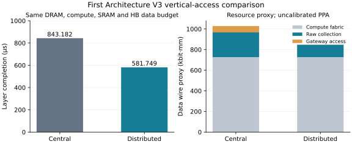

# Architecture V3：P0–P6 交付与首项垂直接入比较

本轮完成独立物理机器、网络导出、工作负载／放置分离、共享原生 DRAM 接入、
三种端到端组织和旧 artifact 清理。保留唯一整数 ps kernel、BookSim
Router/VC/Credit 和锁定 Ramulator 命令后端；没有合并 `wafer_simulator`，没有修改 `rtl/`。

在新的 2×2 Reticle、16 Cluster 候选机器上，同一冷单-token routed FFN 层，
Central Vertical Access 完成于 **843.182 μs**，Distributed 完成于 **581.749 μs**：
完成时间减少 **31.006%**，速度比 **1.449×**。原始数据收集线代理减少 **50%**。
这些是新机器的联合组织比较，不复用 V2 的 258.830 μs 等性能身份，也不代表真实 PPA。

## 阶段验收

| 阶段 | 实际交付 | 完成证据 |
|---|---|---|
| P0 | 冻结 `37400e6` 及另行运行的 V2 128 B 成本实验；记录源码、原生工具与服务器结果身份 | `v2-frozen-37400e6`、`v2-cost-128-d5674f9`、`v2-cost-analysis-6120344`；[冻结清单](../../artifacts/provenance/v2_freeze/manifest.json) |
| P1 | `WaferStack`，独立 Region/Cluster/Router/Domain/HB/Gateway，显式物理图与不可变资源预算 | `architecture/` 编译合法 16 Cluster 机器；拒绝重复资源、非法位置和未声明扩容 |
| P2 | 直接物理图→BookSim exporter；独立 vendor、补丁与构建，不接收 RapidChiplet 字典 | 同一旧物理图三项 causal fixture 的新旧 native 完整记录相同；独立原生构建成功 |
| P3 | 逻辑算子／Tensor IR、权重与计算 Mapping、执行 Lowering 分离 | 同一逻辑工作可编译到不同 Fabric/Gateway；Tensor 身份与物理副本独立 |
| P4 | 唯一物理原生 controller，多个地址／端口视图共享命令、容量和返回预算 | 128 Domain 不因 Gateway 增多复制；真实 16 B 地址、收集传播、HB、CDC、有限 Gateway 输出进入执行 |
| P5 | Central、Distributed、External Streaming 配方，有限数据驱动 GEMM与完整归约链 | 三项完整层原生执行完成；独立事件、字节和资源核验通过 |
| P6 | 移除旧根 artifact、旧几何与旧 Python 执行入口；BookSim 放入独立 third_party；重写当前导航 | 当前源码 AST 依赖审计通过；[删除清单](../legacy/REMOVED_SOURCE.json) 可按 Git tag 恢复；来源和许可证保留 |

分阶段提交保留在 Git 历史。`v3-first-vertical-20261009` 冻结 Central/Distributed
运行源码 a219300；`v3-edge-20261009` 冻结修正后的 External 源码 b28a444。
最后的纯包路径、资源校验和文档整理另行提交，未回写冻结输入。

## 机器与公平比较边界

计算基础来自公开的分布式 Compute/SRAM/Router 组织，参数与聚合比例详见
[物理假设](../PHYSICAL_ASSUMPTIONS.md)。这不是 Cerebras 产品复刻，也不是已量产的
Compute＋DRAM 全晶圆组合。Memory Wafer 没有额外横向 Router。

| 全机器资源 | Central | Distributed |
|---|---:|---:|
| 物理 Reticle 区域／Cluster／Router | 4／16／16 | 相同 |
| 候选 PE／MAC per cycle | 65,536／262,144 | 相同 |
| SRAM／DRAM | 3 GiB／8 GiB | 相同 |
| 独立 DRAM Domain | 128 | 相同 |
| 原生接口 | 每域 16 B／3760 ps | 相同 |
| HB 数据 lane | 16,384 | 相同 |
| Gateway 输出 | 512 B／logic cycle | 相同 |
| Gateway staging／descriptor 槽 | 512 KiB／128 | 相同 |
| 原生返回预约 | 每域 64 个 16 B atom，共 128 KiB | 相同 |
| Compute Fabric | 48 有向宏观通道；128 B data cut；32 KiB/input | 相同 |
| Gateway 数量 | 4 | 16 |
| 每区域接入 | 中心 1×4096-bit HB，128 B/cycle | 四个 1024-bit HB，4×32 B/cycle |

Central 的四个内容地址视图共享每区域 32 个 MC 槽，不能变成四份 controller。
Distributed 每区域四个 Gateway 各 8 槽。所有 Domain 保持各自唯一的 native queue
和 64-atom 预约预算，地址视图重叠不会增加物理容量。不同内容重叠通过 storage identity 校验拒绝。

32 域／区域的粗空间位置生成到 HB landing 的 Manhattan 路径，两边都支付每毫米
一个 native-clock 注册阶段。Central 中心 Gateway 通过明确计费的 64-cycle
路径到达一个已有四分区 Router；Distributed 落在四个 Cluster/Router 的位置。
该 Central fanout 是第一份可执行参考，尚未证明是最佳集中式接入。

Intra-reticle 路径和 100 μm boundary stitch 是不同物理段；宏观通道分别聚合
64／65 个 fine hops。它不是一条 26–33 mm 的短 stitch，也不是完整细粒度
路由复刻。Cluster 与 Router 的独立身份已支持不同数量；当前编译器要求 Cluster
与其接入 Router 共址，远程接入必须另建有成本的路径。

容量采用 64 MiB/domain，是 V2 行数的四倍；refresh 占用明确改为 nRFC=172，
nREFI=1037，使用分相刷新。q4、有限行选择窗口为 4。容量／刷新比例、SRAM
银行组织和控制器面积都是候选假设，不是公开器件的完整标定。

## 完整层结果

输入为冻结 c0_b1：step 17、layer 0，一个 token、8 个激活 expert；128 个 expert
的所有权重预先部署，单 expert 12 个 intermediate blocks。全库约 2.25 GiB，
本层冷读 151,031,808 B。不是四-token V2，也不是整模型推理。

| 组织 | 完整层 μs | Compute Fabric hop-flits | 原生字节 | 核验 |
|---|---:|---:|---:|---|
| Central Vertical | 843.182 | 1,463,556 | 151,031,808 | 通过 |
| Distributed Vertical | 581.749 | 52,536 | 151,031,808 | 通过 |
| External Streaming 参考 | 1459.319 | 2,717,796 | 151,031,808 | 通过 |

Central/Distributed 的 Logical SHA、权重内容／地址 SHA、计算放置 SHA、MAC/
vector work、native 配置和整个执行任务图均相同。共有 490 tasks、37,152 read
descriptors、4,719,744 个 32 B words；Tensor transfer 为 4,907,008 B。
实际 BookSim hop-flits 减少 **96.410%**，未将前端规划路径当成实际执行轨迹。

External 保持计算／逻辑和原生服务代理，但有四个 32 B/cycle 边缘端口，
全机 128 GB/s I/O，20 ns 外部传播和 64-cycle 边缘接入；数据从最近边缘 Router
进入现有 Fabric。外部 DRAM、I/O 和系统成本单列，不能解释为等成本垂直对照，
也不量化复刻 MemoryX。

早期 a219300 的 External 配方把部分边缘端口接到内部 Router，已取消并标记无效。
只引用 b28a444 的修正结果；Central/Distributed 不受这项修正影响。

## 资源账本与压力

| 数据线路资源代理，全机 | Central | Distributed |
|---|---:|---:|
| 固定 Compute Fabric data wire，bit·mm | 726,630.4 | 726,630.4 |
| DRAM 域→HB 原始收集线，bit·mm | 241,664 | 120,832 |
| 收集 pipeline register bits | 247,808 | 122,880 |
| Gateway→Router data wire，bit·mm | 60,416 | 0，共址 |
| Gateway→Router pipeline bits | 262,144 | 0 |
| HB control lane bits | 256 | 1,024 |
| Gateway control datapath bits | 256 | 1,024 |

原始收集线减少 50%；上表三种数据线合计减少约 17.62%，但不是全部通信成本。
分布式组织额外 768 个 HB control sites 和 768 个 Gateway control bits，合计
1,536 个已声明控制位资源。HB 数据位宽、Fabric buffer/metadata、返回存储与 MAC/SRAM
未增加。原生命令元信息、NI metadata 和控制网络另有账本，controller 面积与完整
命令控制布线未标定；不能将这些位数转换成已测面积或能耗。

| 执行压力记录 | Central | Distributed |
|---|---:|---:|
| 最后阵列读 beat tail，μs | 840.5292 | 579.1152 |
| 最后 Gateway payload native-ready，μs | 840.649 | 579.153 |
| 最忙 SRAM 接收写口的服务工作，μs | 117.828 | 114.345 |
| 最忙引擎算术 busy，μs | 3.017 | 2.816 |
| 最忙引擎 held-context，μs | 832.673 | 573.510 |
| 最忙宏观链路累计发送／全层周期 | 16.361% | 1.086% |
| 队头未供数、后面已就绪，source×cycles | 1,225,990 | 3,901 |
| 上项且有 injection credit，source×cycles | 1,225,695 | 3,901 |
| 就绪队头等 injection credit，source×cycles | 39,473 | 2,033 |

表中服务工作、context occupancy、周期采样和最终时间不能相加成总 stall。
累计链路发送比例也不排除短时间突发拥塞。每项 native 供数最后时刻随接入组织
明显变化，说明它包含任务释放与请求反馈，不是固定 trace 的纯线延迟比较。

Native source 继续 FIFO、单 VC，没有越过未供数队头。Central 的源端就绪阻塞
显著，而 Distributed 的本地 payload DMA／源端路径不同。**31.006% 是 Gateway
位置、原始收集、有限池化、横向传输和保留仲裁策略的联合效果**；不能归因为
“物理距离单独贡献 31%”或断言峰值 NoC 带宽是唯一瓶颈。

最忙物理 Domain 的权重工作量两边均为 1,769,920 B，对应接口峰值必要时间界
415.9312 μs。行切换、刷新、有限请求和消费反馈尚未计入这个界；与实测的差值
不能全当作可消除网络开销。

## 执行及迁移核验

所有构建和实验在 hn072 隔离目录执行，未在本地跑仿真。完整层日志有定时检查；
旧与新执行 worktree 固定提交，开发同步只修改另一个 source checkout。

- 独立 BookSim 与 bridge 构建成功；两个构建的 bridge SHA 相同。BookSim 的构建路径
  改变后 binary SHA 不同，分别保存身份，以行为迁移检查验证，而非要求二进制逐字节相同。
- 同一旧物理图的三个 native 因果 fixture，迁移前后包括完整事件记录、整数 ps 完成时刻
  和资源计数相同：103000／171000／255000 ps。
- V3 包路径／类型整理的小型完整 FFN 迁移前后选定的任务时间、SRAM、引擎、MC、
  原生服务及网络计数记录相同：Central 54.489 μs、
  Distributed 54.143 μs、External 55.498 μs；不是要求升级后的机器复制 V2 时间。
- 三项 full runs 独立重新解析 raw result，核对冻结输入、任务依赖、每周期 MAC／
  SRAM-read 预算、native 16 B 地址、原始数据收集、链路容量、有限存储及最终 drain。
- 资源守恒与 storage alias 检查通过；当前源码依赖边界、物理记录往返及相关回归通过。

冻结完整层使用的 BookSim SHA-256：
`8d89e7fd8d0b758a2fcd488b5cfd8f6cdf5ecdc7e62d6c40f97905842fc00325`。
最终独立目录构建／回归使用：
`79f393ed26af5997a6513a4ae9d77398adedcff2f3edd5d3d6e6b6c8ba5a7a34`。
DRAM bridge：`37eb00768993fb5cfd903c690e72a21cdc69e10f4acbc421762f54dc5a33ba54`。
Ramulator upstream：`72427a1bba3771564c4fb0e494ba02242fd1eaa7`。

## 限制与研究结论

当前结果支持：**在固定分布式计算、原生 DRAM 和总数据接入预算下，垂直接入的空间
组织能够改变横向搬运、队列反馈和完整层时间；更多 Gateway 不必复制 DRAM 服务。**
它没有证明 Distributed 是所有 workload 或接入扇出的最优方案。

模型保留理想瞬时全局 RX booking、一个 aggregate engine context、保守的每消费者
activation 副本和完整 matrix SRAM 预约。Streaming GEMM 只在已 commit 的 operands
与 scales 到齐后推进；gate/up 完成后才 SiLU，下投影使用完成的 gated activation。
没有宣称无 staging、微线程、multicast 或数值 bit-exact 推理。

公开产品参数用作聚合尺度依据；fine-to-macro routing、SRAM bank conflicts、命令／
控制路径、ACT power 和 PPA 未完全校准。全权重库能放进 aggregate 3 GiB SRAM，
因此冷单层结果不证明反复执行一个暖驻留层需要 DRAM。容量动机应放在多层／整模型
工作集上另行验证，不能用当前单层结果替代。

## 复现与归档

当前命令与原生构建见 [README](../../README.md)。精选、可审阅分析为
[analysis.json](../../artifacts/results/architecture_v3/analysis.json)；
[交付 manifest](../../artifacts/provenance/architecture_v3/delivery-manifest.json)
记录冻结源码、输入 SHA、raw captures SHA 和服务器路径，
[精选证据包](../../artifacts/provenance/architecture_v3/selected-delivery-evidence.tar.gz)
包含配置、日志、独立核验、迁移对照与 build manifests。
大 captures、binary 和环境保持 Git 外。

服务器根：`hn072:/Projects/haoning/w2w-full-system-v3-20261009`。
Central/Distributed 在 `study-v1`；修正 External 在 `edge-study-v1`。
冻结完整层使用 `native-p2`／`native-p4`；最终独立构建在 `native-p6`。
最终回归／分析源码 f20f7d5；报告与导航的后续提交不改变
冻结机器和执行记录。分析命令可用 `--external-reference` 同时核验两个注册目录，
保留各自源码身份。

V2 的窄 NoC 成本实验另见 [历史报告](../legacy/reports/COMMUNICATION_BUDGET_REPORT.md)，
不与本报告的新机器混为同硬件比较。
