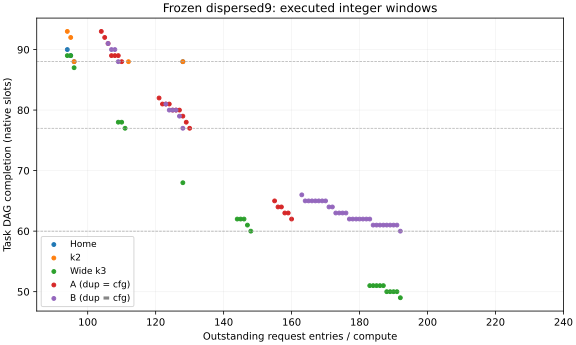

# 固定共享接口需要多少请求状态：下界与最小可执行配置

2026-10-08；执行源码 `7663f3606dad7137e975049098205f5b840af487`；eex005 干净隔离目录
`/home/wangziheng/Video/w2w-request-window-20261008`。

**B 无需512个outstanding即可保持已有高窗口实验的服务，192个已足够；但达到同样的
60槽完成目标，宽k3只需148个。** B的lane和接入线更少，却需要更多请求状态。
现有架构的成本取舍因此还应包含请求供给，不能只比较发送FIFO和长线。

本轮固定全部已有接口、布局、仲裁和地址顺序，只改变每compute请求窗口N。
全部最小值指**当前确定性执行合同、注册任务与目标下的最小整数N**；不是所有调度策略
或真实DRAM控制器的全局硬件下界。[预注册协议](../methods/REQUEST_WINDOW_STUDY.md)。

## 1. 已有推导落实成了什么

一个字从发起到交付占一个outstanding。对每个必需来源p，字数n_p、最小生命周期l_p满足：

\[
E=\sum_p n_p l_p,\qquad N T_{\rm read}\ge E.
\]

E是所有字的最低占位槽数之和；实际占位积分至多为N乘读阶段长度。因此这是必要条件，
不包含排队、竞争和拍内相位损失。原生bank、出口bit、发起配额的独立下界也同时计算，
再沿显式任务依赖、release与读后计算传播到整个DAG。

当前request/native/link延迟为1/0/1槽：256-bit Home字至少占3槽，128/160-bit Shared字
至少占4槽。B的2496字为1536 Home＋960 Shared，E=8448；N128时读等待至少66槽，
原有实测为69槽。这说明原合同下仅调整请求顺序不可能达到高窗口实验的52槽读等待。

按固定字节比例持续兑现独占接口参考率时，必要N为：

| 接口 | 参考率，words/slot/C | 生命周期必要N |
|---|---:|---:|
| Home | 32 | 96 |
| A | 48 | 160 |
| B | 52 | 176 |
| 宽k3 | 64 | 192 |

这是稳态必要界，不是下面有限完成目标的充分窗口。B在N176时实际完成63槽，N191时61槽，
N192才达到60槽；不能把176写成已经兑现目标的实现。k2含private-bank依赖，表中没有将
64 words/slot当作其所有compute都可实现的目标。

## 2. 同一个任务目标需要多少窗口

dispersed9沿用既有对象与九个坐标选出的compute。88、77、60槽分别来自已归档的
Home、B128、B512；不是根据本轮搜索结果选目标。低于资源下界的目标直接排除，其余从
必要N开始逐整数回放，保存所有失败点，首个达标即为最小值。没有使用二分或单调性假设。

| 完成deadline | Home最小N | k2最小N | 宽k3最小N | A最小N | B最小N |
|---|---:|---:|---:|---:|---:|
| 88 | 96 | 96 | 96 | 110 | 109 |
| 77 | 不可能 | 不可能 | 111 | 130 | 128 |
| 60 | 不可能 | 不可能 | 148 | 不可能 | 192 |

这里“不可能”由当前布局的必需数据与资源下界证明：Home/k2至少88槽，A至少62槽，
并非只因N512没有达到。B的独立资源下界为58槽，故不声称60槽是任意调度的理论最优。

达到同一60槽目标时，B-configurable相对宽k3：

| 成本项 | B configurable | 宽k3 |
|---|---:|---:|
| Lane bits/M | 18,432 | 24,576 |
| TX buffer proxy bits/M | 24,576 | 8,192 |
| 接入wire bit-mm/M | 341,664.0 | 474,163.2 |
| 请求entries/C | 192 | 148 |

B少25% lane、约27.94%接入线，但TX buffer为3倍，请求entries多约29.73%。
这是同任务、同完成目标下可复核的多资源取舍；没有用未经校准的权重压成“总面积”。



图只画实际执行的点，不对必要界排除区间插值；512控制点保留在原始记录中。

## 3. 一个固定窗口同时满足三个已知场景

每个结构以自身已归档512窗口下的dispersed9、clustered9、full36完成时间为目标。
先分别求最小N，再检查一个共同N是否同时达标；不默认“取三个最小值的最大值”就一定可行。

| 结构 | 分散最小N | 相邻最小N | 全忙最小N | 已验证共同最小N | 三场景完成时间 |
|---|---:|---:|---:|---:|---|
| Home | 96 | 96 | 96 | 96 | 88 / 88 / 88 |
| k2 | 96 | 109 | 112 | 112 | 88 / 88 / 88 |
| 宽k3 | 192 | 128 | 128 | 192 | 49 / 88 / 88 |
| A | 160 | 160 | 160 | 160 | 62 / 88 / 88 |
| B | 192 | 160 | 160 | 192 | 60 / 88 / 88 |

A/B的duplicated与configurable使用同N时保持完全相同服务。B的192比512少62.5%请求槽，
相对原128增加64 entries/C；A增加32 entries/C。这是请求容量计数，未综合请求控制器。

搜索确实遇到非单调点：宽k3的clustered9在N96为89槽，N97为90槽，N104为92槽。
N改变进入队列的请求时序，固定仲裁下的完成时间可能反向变化。这不表示更大硬件的最优
能力变差——允许节流到较小窗口即可保留旧行为；本轮没有增加这种调度策略。

## 4. 固定所选N后，保留全部七类任务

下表使用上面的共同最小N，A/B两种实现结果相同；单位为原生槽。

| 场景 | Home N96 | k2 N112 | 宽k3 N192 | A N160 | B N192 |
|---|---:|---:|---:|---:|---:|
| single | 88 | 77 | 49 | 62 | 60 |
| dispersed9 | 88 | 88 | 49 | 62 | 60 |
| clustered9 | 88 | 88 | 88 | 88 | 88 |
| full36 | 88 | 88 | 88 | 88 | 88 |
| moving9 | 352 | 352 | 352 | 352 | 352 |
| straggler9 | 354 | 310 | 198 | 250 | 242 |
| short9 | 4 | 4 | 3 | 4 | 4 |

相邻热点和全忙仍无共享加速；窗口补足只消除了A/B此前多出的一个槽，moving9也从356
恢复352。short9的A/B仍为4槽。分散热点B为60对Home88，缩短31.8%，与已有512控制一致。

**k2的N112不能称为保住全部共享机会的窗口。** 它满足三个注册目标，但single从N128的
68槽退为77，straggler9从275退为310。三场景同步目标未要求保留这两个场景的加速。
因此，不能用本表宣布A/B在single或straggler上战胜充分供给的k2；原N128强对照必须保留。
这里的退化说明“最小窗口”必须带目标集合，不能脱离任务合同给接口一个通用最小值。

所选固定N的投影前沿将请求entries加入makespan、lane、TX buffer、wire四项旧维度；
原始结果保留每个场景的集合。它只覆盖这组固定窗口候选，不覆盖任意N、调度或完整物理成本。

## 5. 成本边界与对现有贡献的影响

请求entries以N/C与36N/wafer单列。每entry的地址、tag、合并、credit控制和逻辑面积仍未知；
不能将一个entry当作一个256-bit FIFO，也不能直接从source面积节省中扣除entries。
RX、pipeline、HB与原成本分项保留；模型仍无独立反向credit传播时延。

因此，本轮没有证明“发送端节省的面积已经覆盖新增请求硬件”。它完成的是前置且可验证的
问题：**兑现已知服务需要多少请求容量，以及这项容量怎样改变已有接口间的成本交换。**
Configurable在相同N下的请求成本相同，发送状态复用的收益仍可独立归因。

对已有两项贡献的补强是：

1. 有限共享组织：伙伴覆盖与必需字节竞争决定是否存在机会，请求窗口决定机会能否兑现。
   相邻热点没有因补credit变快，不能把供给损失和伙伴竞争合成同一个sharing系数。
2. 静态mapping驱动实现：布局已经给出每条必需路径的字数，结合完整字时序即可产生请求
   状态的必要界，再用冻结执行器构造最小达标见证。现有方法由“接口容量＋FIFO成本”延伸到
   “同任务目标＋请求容量成本”，没有增加新的endpoint或匹配框架。

后续可将这一窗口—目标表用于真实阶段的同预算对照；请求metadata硬件成本尚需单独校准。
本轮不继续扩大FIFO、placement、matching或RTL搜索。

## 6. 验证与复现

- 37项定向测试通过：14项新增下界/搜索测试＋23项既有read-workload测试；未声称全仓重跑。
- 42组旧128/512控制的任务、驻留、事件hash、计数、stall等完全复现。
- 502次回放，合计23,908,224个模型字；逐槽守恒和所有任务完成检查通过。
- 27份deadline证书：22个最小窗口、5个资源下界不可能；另有5个共同窗口最小性证书。
- 29组duplicated/configurable对照完全一致。
- 独立读取压缩原始记录，核对文件/逐记录hash、字节计数、逐任务下界、所有排除区间及每个
  达标见证；未假设回放性能单调。实验约369.97秒，单线程数值库。

```sh
OPENBLAS_NUM_THREADS=1 OMP_NUM_THREADS=1 /home/wangziheng/Video/w2w-memory/.venv/bin/python \
  -m unittest tests.test_request_window tests.test_read_workload -v
OPENBLAS_NUM_THREADS=1 OMP_NUM_THREADS=1 /home/wangziheng/Video/w2w-memory/.venv/bin/python \
  -m w2w.experiments.run_request_window --output memory_results/request_window
OPENBLAS_NUM_THREADS=1 OMP_NUM_THREADS=1 /home/wangziheng/Video/w2w-memory/.venv/bin/python \
  -m w2w.analysis.request_window memory_results/request_window --render
```

这仍是合成有限任务的word/bit-budget证据，不是新增RTL payload、真实DRAM时序或MoE加速。
原生槽与2ns ASIC时钟不合并；本轮没有修改另一条开发线的RTL或真实路由导入。

[完整结果与证书](../../artifacts/results/workload/request_window/) ·
[审计](../../artifacts/results/workload/request_window/audit.json) ·
[源码、日志与文件hash](../../artifacts/provenance/request_window_manifest.json)。
